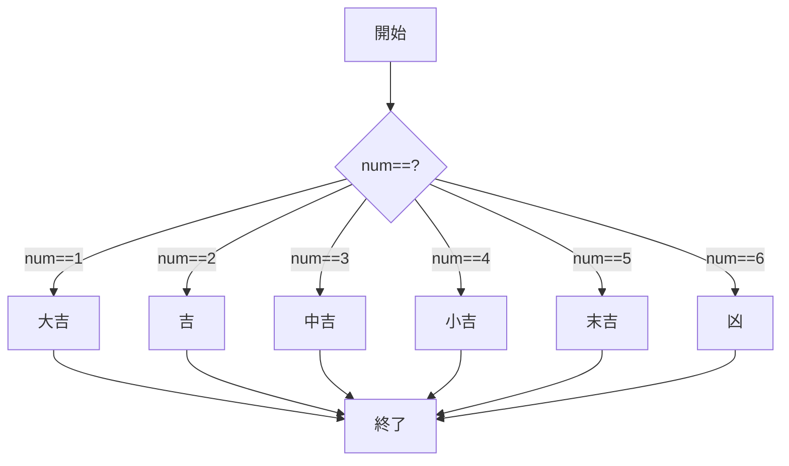
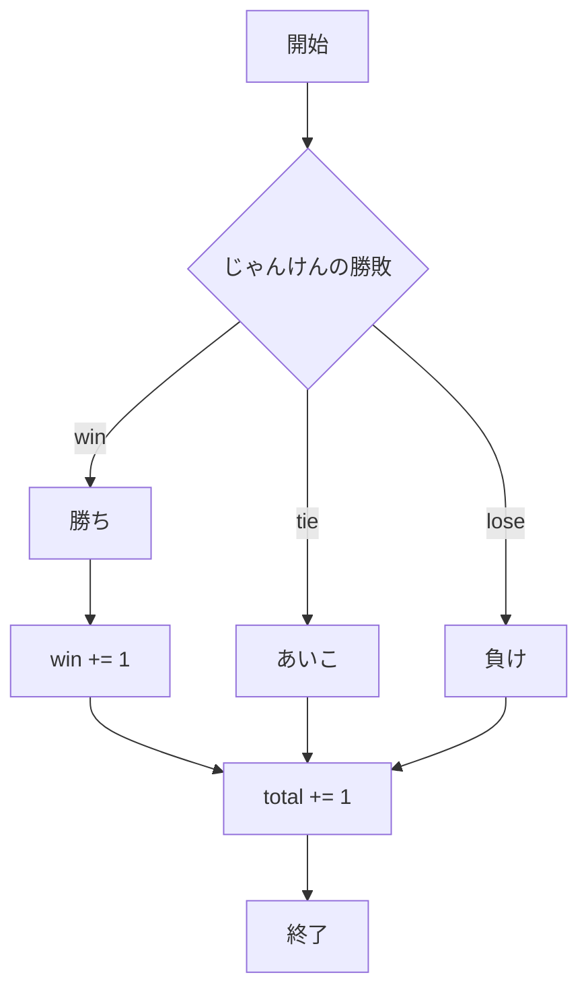
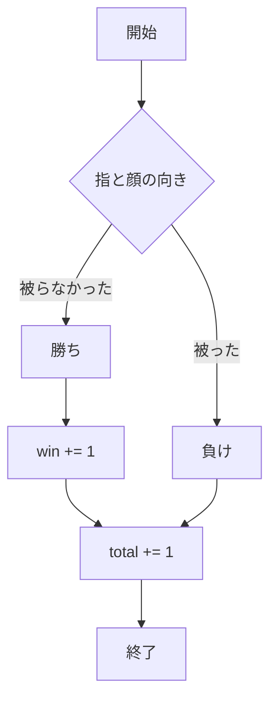
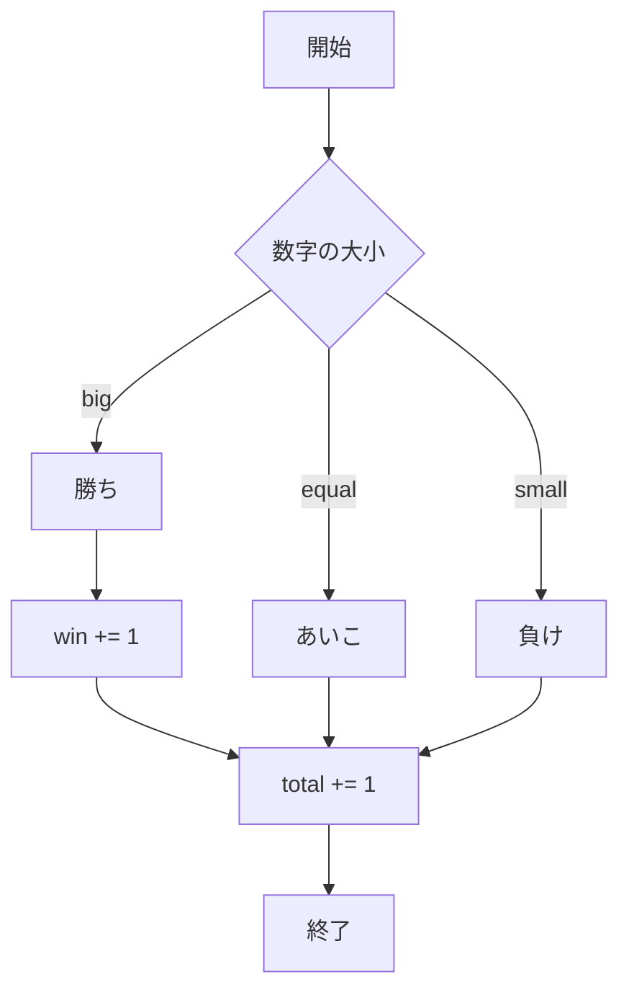

# webpro_06
2024/11/18(月)
24G1006　足立 輝弥

## このReadMeについて
このReadMeは，app5.js内に記載したじゃんけん及びWebプログラミング第7週の課題で追加した機能2つを中心に，app5.js全体についてソースコードやフローチャートを用いて説明したものである．
## ファイル一覧
今回の課題では「あっち向いてホイ」と，ランダムな数字の大小で勝敗を決める「数字の大小(仮称)」の機能を追加した．
ファイル名 | 説明
-|-
app5.js | プログラム本体
views/show.ejs | /hello1，/hello2の結果画面
views/icon.ejs | /iconの結果画面
views/luck.ejs | おみくじの結果画面
public/janken.html | じゃんけんの開始画面
views/janken.ejs | じゃんけんの結果画面
public/hoi.html | あっち向いてホイの開始画面
views/hoi.ejs | あっち向いてホイの結果画面
public/size.html | 数字の大小の開始画面
views/size.ejs | 数字の大小の結果画面

## 1:/hello1，/hello2
まずは/hello1，/hello2について説明する．
### 1-1:ソースコード
#### 1-1-1:/hello1
```javascript
app.get("/hello1", (req, res) => {
  const message1 = "Hello world";
  const message2 = "Bon jour";
  res.render('show', { greet1:message1, greet2:message2});
});
```
#### 1-1-2:/hello2
```javascript
app.get("/hello2", (req, res) => {
  res.render('show', { greet1:"Hello world", greet2:"Bon jour"});
});
```

### 1-2:起動方法及び動作内容
1. app5.jsを起動する(ターミナルで```node app5.js```)
1. Webブラウザで```localhost:8080/hello1```，```localhost:8080/hello2```にアクセスする
1. views/show.ejsのフォーマットに則り，文字列が表示される．

## 2:/icon
次に/iconについて説明する．
### 2-1:ソースコード
```javascript
app.get("/icon", (req, res) => {
  res.render('icon', { filename:"./public/Apple_logo_black.svg", alt:"Apple Logo"});
});
```

### 2-2:起動方法及び動作内容
1. app5.jsを起動する(ターミナルで```node app5.js```)
1. Webブラウザで```localhost:8080/icon```にアクセスする
1. publicフォルダ内の画像(```Apple_logo_black.svg```)が表示される．

## 3:おみくじ
次におみくじについて説明する．
### 3-1:ソースコード
```javascript
app.get("/luck", (req, res) => {
  const num = Math.floor( Math.random() * 6 + 1 );
  let luck = '';
  if( num==1 ) luck = '大吉';
  else if( num==2 ) luck = '吉';
  else if( num==3 ) luck = '中吉';
  else if( num==4 ) luck = '小吉';
  else if( num==5 ) luck = '末吉';
  else if( num==6 ) luck = '凶';
  console.log( 'あなたの運勢は' + luck + 'です' );
  res.render( 'luck', {number:num, luck:luck} );
});
```

### 3-2:起動方法及び動作内容
1. app5.jsを起動する(ターミナルで```node app5.js```)
1. Webブラウザで```localhost:8080/luck```にアクセスする
1. 生成された数字に応じたおみくじの結果(大吉〜凶)が表示される．

### 3-3:フローチャート


## 4:じゃんけん
次にじゃんけんの機能について説明する．
### 4-1:ソースコード
```javascript
app.get("/janken", (req, res) => {
  let hand = req.query.hand;
  let win = Number( req.query.win );
  let total = Number( req.query.total );
  console.log( {hand, win, total} );
  const num = Math.floor( Math.random() * 3 + 1 );
  let cpu = '';
  if( num==1 ) cpu = 'グー';
  else if( num==2 ) cpu = 'チョキ';
  else cpu = 'パー';
  
  let judgement = '';
  if( hand == 'グー' ) {
    if( num==1 ) {judgement = 'あいこ';}
    else if( num==2 ) {judgement = '勝ち', win += 1;}
    else {judgement = '負け';}
    total += 1;
  }
  if( hand == 'チョキ' ) {
    if( num==1 ) {judgement = '負け';}
    else if( num==2 ) {judgement = 'あいこ';}
    else {judgement = '勝ち', win += 1;}
    total += 1;
  }
  if( hand == 'パー' ){ 
    if( num==1 ) {judgement = '勝ち', win += 1;}
    else if( num==2 ) {judgement = '負け';}
    else {judgement = 'あいこ';}
    total += 1;
  }
  
  const display = {
    your: hand,
    cpu: cpu,
    judgement: judgement,
    win: win,
    total: total
  }
  res.render( 'janken', display );
});
```

### 4-2:起動方法及び動作内容
1. app5.jsを起動する(ターミナルで```node app5.js```)
1. Webブラウザで```localhost:8080/public/janken.html```にアクセスする
1. 自分の手(グー、チョキ、パーのいずれか)をテキストボックス内に入力する
1. 一般的なじゃんけんのルールに則り，勝敗が決定する

### 4-3:フローチャート


## 5:あっち向いてホイ
次に，あっち向いてホイの機能について説明する．なお，本課題ではコンピュータが指を指す側，プレイヤーが顔を振る側とした．
そのため，プレイヤーが選択した顔の向きとコンピュータが指した指の方向が違う場合は勝ちとし，同じである場合のみを負けとする．
### 5-1:ソースコード
```javascript
app.get("/hoi", (req, res) => {
  let face = req.query.face;
  let win = Number( req.query.win );
  let total = Number( req.query.total );
  console.log( {face, win, total} );
  const num = Math.floor( Math.random() * 4 + 1 );
  let cpu = '';
  if( num==1 ) cpu = '上';
  else if( num==2 ) cpu = '下';
  else if( num==3 ) cpu = '左';
  else cpu = '右';
  
  let judgement = '';
  if( face == '上' ) {
    if( num==1 ) {judgement = '負け';}
    else if( num==2 ) {judgement = '勝ち', win += 1;}
    else if( num==3 ) {judgement = '勝ち', win += 1;}
    else {judgement = '勝ち', win += 1;}
    total += 1;
  }
  if( face == '下' ) {
    if( num==1 ) {judgement = '勝ち', win += 1;}
    else if( num==2 ) {judgement = '負け';}
    else if( num==3 ) {judgement = '勝ち', win += 1;}
    else {judgement = '勝ち', win += 1;}
    total += 1;
  }
  if( face == '左' ){ 
    if( num==1 ) {judgement = '勝ち', win += 1;}
    else if( num==2 ) {judgement = '勝ち', win += 1;}
    else if( num==3 ) {judgement = '負け';}
    else {judgement = '勝ち', win += 1;}
    total += 1;
  }
  if( face == '右' ){ 
    if( num==1 ) {judgement = '勝ち', win += 1;}
    else if( num==2 ) {judgement = '勝ち', win += 1;}
    else if( num==3 ) {judgement = '勝ち', win += 1;}
    else {judgement = '負け';}
    total += 1;
  }
  
  const display = {
    your: face,
    cpu: cpu,
    judgement: judgement,
    win: win,
    total: total
  }
  res.render( 'hoi', display );
});
```

### 5-2:起動方法及び動作内容
1. app5.jsを起動する(ターミナルで```node app5.js```)
1. Webブラウザで```localhost:8080/public/hoi.html```にアクセスする
1. 自分の顔の向き(上下左右いずれか)をテキストボックス内に入力する
1. 今回設定した(本章の頭で説明した)ルールに則り，勝敗が決定する

### 5-3:フローチャート


## 6:数字の大小
最後に，数字の大小の機能について説明する．このソースコードは，選択肢であるAからEの5つのアルファベットに1から5の数字をランダムに代入し，
選んだアルファベットに対応する数字とコンピュータの提示する数字の大小を競いあうというものである．
### 6-1:ソースコード
```javascript
app.get("/size", (req, res) => {
  let choice = req.query.choice;
  let win = Number( req.query.win );
  let total = Number( req.query.total );
  console.log( {choice, win, total} );

  let numbers = [1, 2, 3, 4, 5];

  function shuffleArray(arr) {
      for (let i = arr.length - 1; i > 0; i--) {
          const j = Math.floor(Math.random() * (i + 1)); 
          [arr[i], arr[j]] = [arr[j], arr[i]];
      }
  }

  shuffleArray(numbers);

  let a = numbers[0];
  let b = numbers[1];
  let c = numbers[2];
  let d = numbers[3];
  let e = numbers[4];

  let num1;
  if( choice === 'A' ){ num1 = a; }
  else if( choice === 'B' ){ num1 = b; }
  else if( choice === 'C' ){ num1 = c; }
  else if( choice === 'D' ){ num1 = d; }
  else if( choice === 'E' ){ num1 = e; }

  let player = String(num1);

  const num2 = Math.floor( Math.random() * 5 + 1 );
  let cpu = '';
  if( num2==1 ) cpu = '1';
  else if( num2==2 ) cpu = '2';
  else if( num2==3 ) cpu = '3';
  else if( num2==4 ) cpu = '4';
  else cpu = '5';
  
  let judgement = '';
  if( num1 < num2 ) {
    {judgement = '負け';}
    total += 1;
  }
  if( num1 == num2 ) {
    {judgement = 'あいこ';}
    total += 1;
  }
  if( num1 > num2 ){ 
    {judgement = '勝ち', win += 1;}
    total += 1;
  }
  
  const display = {
    your: player,
    cpu: cpu,
    judgement: judgement,
    win: win,
    total: total
  }
  res.render( 'size', display );
});
```

### 6-2:起動方法及び動作内容
1. app5.jsを起動する(ターミナルで```node app5.js```)
1. Webブラウザで```localhost:8080/public/size.html```にアクセスする
1. A,B,C,D,Eのうちいずれかをテキストボックス内に入力する
1. 選んだアルファベットに対応する数字とコンピュータの提示する数字の大小により，勝敗が決定する

### 6-3 フローチャート
