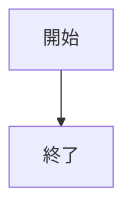
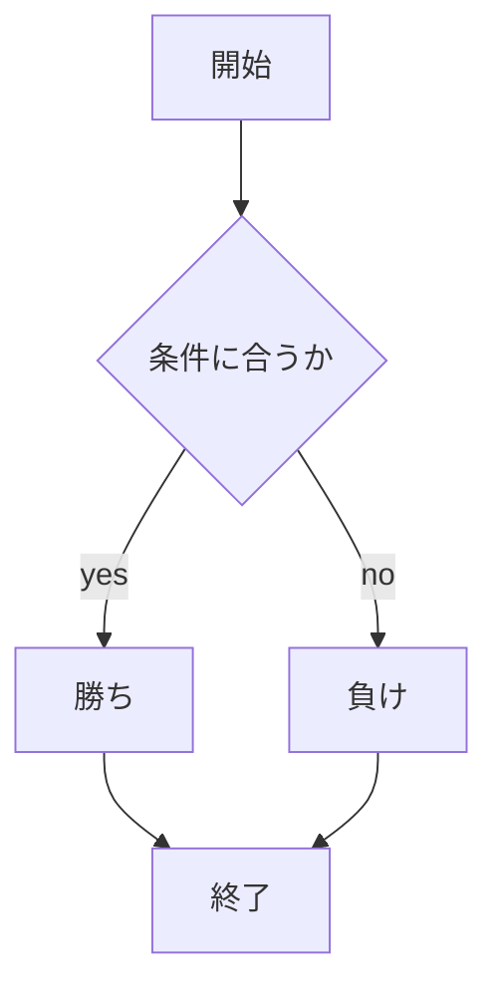
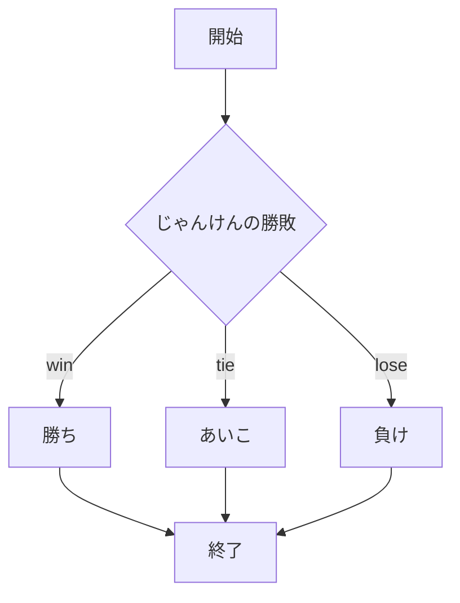

# webpro_06
2024/10/29(Tue)

## このプログラムについて

## ファイル一覧
ファイル名 | 説明
-|-
app5.js | プログラム本体
public/janken.html | じゃんけんの開始画面
janken.ejs | じゃんけんの結果画面

## コードの挿入
```javascript
console.log( 'Hello' );
```

## 箇条書き
1. app5.jsを起動する(ターミナルで```node app5.js```)
1. Webブラウザでlocalhost:8080/public/janken.htmlにアクセスする
1. 自分の手を入力する

## 図の描画


## 凝ったフローチャート
#### (※項目名として「end」は使用できない)


## じゃんけんのフローチャート
